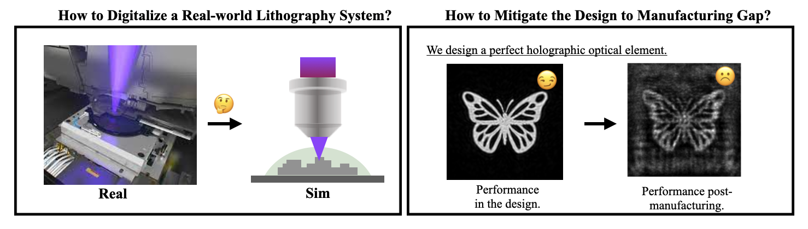
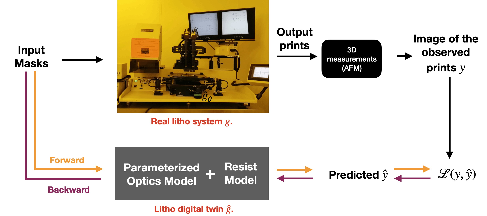

# Neural Lithography

Repo for the project - **Neural Lithography: Close the Design to Manufacturing Gap in Computational Optics with a 'Real2Sim' Learned Photolithography Simulator**
#### [Project Page](https://neural-litho.github.io/) | [ArXiv](https://arxiv.org/abs/2309.17343)| [MIT News](https://news.mit.edu/2023/closing-design-manufacturing-gap-optical-devices-1213)
[Cheng Zheng](https://zcshinee.github.io/)<sup>✉,†,</sup>${^1}$, [Guangyuan Zhao](https://twitter.com/guangyuan_zhao)<sup>✉,†,</sup>$^{2}$, [Peter So](https://meche.mit.edu/people/faculty/ptso@mit.edu) $^{1}$. 
† denotes equal contribution; ✉ denotes corresponding author<br>
$^1$ MIT, $^2$ CUHK.

:pushpin: Related paper accepted to [SIGGRAPH ASIA 2023](https://asia.siggraph.org/2023/submissions/technical-papers/).


--------------
## 1. What We Contribute?

**TL;DR:** :one: A real2sim pipeline to quantitatively digitalize a real-world lithography system into a high-fidelity neural lithography digital twin; :two: A fully-differentiable two-stage design-manufacturing co-optimization framework to bridge the design-to-manufacturing gap in computational optics. 


<details> 
<summary>To expand, this work answers two fundmental questions in computational optics (including computational lithography). See our definition of computational optics in xxx. </summary>


### This work answers two fundmental questions in computational optics (including computational lithography):
1. *What is the "elephant in the room" in Computational Lithography?*
  - **High-fidelity photolithography simulator.** | "No matter how good we can advance the computational (inverse) lithography algorithm, the performance bound is grounded in the fidelity of the lithography simulator."  
  
2. *What hinders the progress of end to end differentiable design computational optics?*
  - One should be the **Design to Manufacturing gap**. | "Yes you can design a perfect lens, but you cannot guarantee the post-manufacturing performance." 





### Accordingly, our work tackles the above questions and opens up two exciting research directions:

1. Real2Sim learning for 3D modelling the fabrication outcome of any real-world photolithography system.


2. Close the Design-to-manfuctuting gap via co-optimizing the manufacturiability and the task design with two intersected differentiable simulators (Litho + Task).

<!-- *t* -->
<!-- ----------------------------------------- -->

</details>

## 2. How to Use this Repo?
See details in [code.md](code.md).


## 3. TODO 
This repo is under active development with more features to be released. 
- [x] Get the first release of the code with code for experiments.
- [ ] Create a simulator to be used as a sandbox.
- [ ] Neural Litho 2.0. Please stay tuned.

## 4. Citation

If you find our code or any of our materials useful, please cite our paper:
```bibtex
@article{zheng2023neural,
            title={Neural Lithography: Close the Design-to-Manufacturing Gap in Computational Optics with a'Real2Sim'Learned Photolithography Simulator},
            author={Zheng, Cheng and Zhao, Guangyuan and So, Peter TC},
            journal={arXiv preprint arXiv:2309.17343},
            year={2023}
            }
```

```bibtex
@inproceedings{zheng2023close,
            title={Close the Design-to-Manufacturing Gap in Computational Optics with a'Real2Sim'Learned Two-Photon Neural Lithography Simulator},
            author={Zheng, Cheng and Zhao, Guangyuan and So, Peter},
            booktitle={SIGGRAPH Asia 2023 Conference Papers},
            pages={1--9},
            year={2023}
}
```
