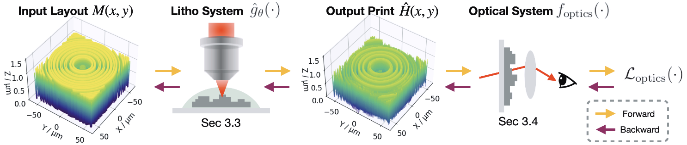

# Neural Lithography

Repo for the project - **Neural Lithography: Close the Design to Manufacturing Gap in Computational Optics with a 'Real2Sim' Learned Photolithography Simulator**
#### [Project Page](https://neural-litho.github.io/) | Paper| [Bibtex](#bibtex)
[Cheng Zheng](https://zcshinee.github.io/chengzheng.github.io/)\* $^{1}$, Guangyuan Zhao\* $^{2}$, Peter So $^{1}$. (*equal contribution)<br>
$^1$ MIT, $^2$ CUHK.

Related paper accepted to [SIGGRAPH ASIA 2023](https://asia.siggraph.org/2023/submissions/technical-papers/).





## What we contribute?
<!-- **Abstract:** We introduce neural lithography to address the ‘design-to-manufacturing’ gap in the design and in a ‘real2sim’ manner. While emerging fabrication and design techniques in computational optics enable large design degrees of freedom and advanced functionalities, the existing design approaches often overlook the numerical modeling of the manufacturing process, which can result in significant performance deviation between the design and the fabrication. We bridge this gap with a fully differentiable design framework specifically in computational optics that integrates a pre-trained photolithography simulator into the model-based optical design loop. 
Leveraging a blend of physics-informed modeling and data-driven training, our photolithography simulator serves as a regularizer on fabrication feasibility during design, compensating for structure discrepancies introduced in the lithography process. 
We demonstrate the effectiveness of our approach through two typical tasks in computational optics, where we design and fabricate a holographic optical element (HOE) and a multi-level diffractive lens (MDL) using a two-photon lithography system, showcasing improved optical performance on the task-specific metrics. -->

**TL;DR:** A real2sim pipeline to quantitatively construct a high-fidelity neural photolithography simulator and a design-fabrication co-optimization framework to bridge the design-to-manufacturing gap in computational optics. 

### This work answers two fundmental questions in compuational optics (including comp litho):
1. What is the "elephant in the room" in Computational Lithography?
  - Constructing an **accurate photolithography simulator**.
2. What is the most urgent problem that hinders the progress of computational optics?
  - The **Design to Manufacturing gap**: Yes you can design a perfect lens, but you cannot guarantee the post-manufacturing performance. 


### Accordingly, our work opens up two exciting research directions:

1. Real2Sim learning for 3D modelling the fabrication outcome of any real-world photolithography system.

2. Close the Design-to-manfuctuting gap via co-optimizing the manufacturiability and the task design from two intersected differentiable simulators (Fabrication + Task).


## How to use the repo?
Click here.

## Citation

If you find our work or any of our materials useful, please cite our paper:
```
To be updated.
```